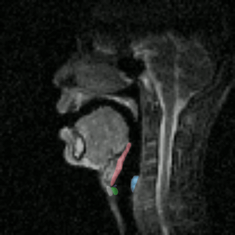

# Larynx segmentation in mid-sagittal speech production real-time MRI

<p align="center">
  
</p>

This repository contains data, checkpoints, and code for larynx segmentation in mid-sagittal real-time speech production MRI.

---

## Dataset
The dataset consists of JPG-format rt-MRI frames and JSON-format segmentation annotations organized as follows:

```text
./data/
├── train/              # Training set
├── eval/               # Validation set
├── test/               # Test set for final evaluation
├── train_data_split/   # Labeled-data subsets generated from one random seed
│                       # (1%, 2.5%, 5%, 7.5%, 10%, 25%, 50%, 75%, and 100%)
└── unlabelled/         # Unannotated rt-MRI frames used for semi-supervised learning
```

---

## Setup
The setup script installs required dependencies, including Detectron2.

```bash
chmod +x ./scripts/setup_env.sh
./scripts/setup_env.sh
```
The Mask2Former model is in:

```text
./Mask2Former
```

---

## Training

Train Mask2Former models:

```bash
python ./scripts/train_maskformer.py
```

Train teacher-student semi-supervised learning models:

```bash
python ./scripts/train_ssl.py
```

---
## Models
Checkpoints trained using 25% and 100% of the labeled training data are provided in:

```text
./models/
├── supervised_model_train25.pth
├── supervised_model_train100.pth
├── semisupervised_model_train25.pth
└── semisupervised_model_train100.pth
```

---
## Inference
To make inferences on new MRI frames:

```bash
python ./scripts/inference.py
```
Sample videos and predicted segmentation masks:
```text
./inference/videos
./inference/masks
./inference/videos_with_masks
```

---
## Citation

If you use this repository in your research, please cite:

```bibtex
@inproceedings{zhang2026larynx,
  author={Zhang, Yubin and Shi, Xuan and Huang, Kevin and Kumar, Prakash and Lee, Kevin and Goldstein, Louis and Krsina, Nayak and Narayanan, Shrikanth},
  title     = {Larynx segmentation in mid-sagittal speech production real-time MRI},
  booktitle = {Proceedings of Interspeech},
  year      = {2026}
}
```
[](https://doi.org/10.5281/zenodo.20767832)
---
